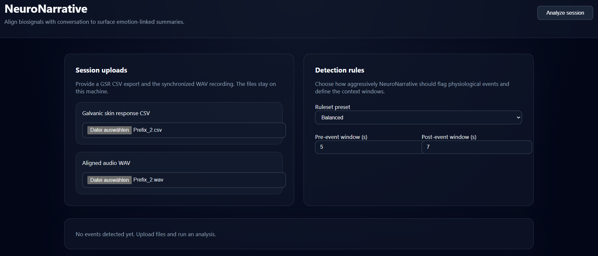

# NeuroNarrative
From biosignal spikes to meaning: align, detect, and summarize speech around GSR/EEG events

## Overview
NeuroNarrative is an open-source playground for synchronising physiological recordings with spoken language.
The current prototype focuses on galvanic skin response (GSR) CSV exports aligned with WAV audio files.
Uploaded sessions are processed locally: the backend validates inputs, extracts basic signal metadata,
performs rule-based event detection, and prepares transcript windows for later summarisation.

> **Project status:** early prototype. Audio transcription is stubbed, and the frontend only offers a minimal
> workflow for uploading files and reviewing detected events.

## Repository layout
```
.
├── backend/               # FastAPI service for ingestion, event detection, and summaries
│   ├── app/
│   │   ├── api/           # HTTP routes and schemas
│   │   ├── core/          # Configuration helpers
│   │   └── services/      # Signal processing, storage, and summarisation helpers
│   ├── pyproject.toml     # Python project definition and dependencies
│   └── tests/             # Pytest suite
├── docker/                # Container build files and compose stacks
│   ├── backend.Dockerfile
│   ├── frontend.Dockerfile
│   └── compose.local.yml
├── docs/                  # Architecture and design documentation
└── frontend/              # React + Vite single-page application shell
    ├── src/
    ├── package.json
    └── vite.config.ts
```

## Getting started

### Docker (backend + frontend)

The repository ships with a local compose stack located under `docker/`. Ensure that Docker Desktop
is running in **Linux container** mode (or that your Docker Engine context points to a Linux host),
then launch the stack from the repository root:

```bash
# Git Bash / WSL / macOS / Linux
docker compose --project-directory "$(pwd)" -f docker/compose.local.yml up --build

# Windows PowerShell
docker compose --project-directory "$PWD" -f docker/compose.local.yml up --build

# Git Bash on Windows when you need a Windows-formatted path
docker compose --project-directory "$(pwd -W)" -f docker/compose.local.yml up --build
```

This starts the FastAPI backend on <http://localhost:8000> and the Vite frontend on
<http://localhost:5173>. Uploads are stored inside a named volume so successive runs can reuse
temporary files.

On Windows make sure Docker Desktop is using the **WSL 2 / Linux** backend (`Settings → General → Use the WSL 2 based engine`).
If you have multiple Docker contexts, verify that `docker context show` returns a Linux-capable
context (for Docker Desktop this is typically `desktop-linux`).

Speech summarisation uses a local LLM. When you have an NVIDIA GPU (e.g. RTX 3070 Ti) available, start
the Ollama sidecar as well:

```bash
# Git Bash / WSL / macOS / Linux
docker compose --project-directory "$(pwd)" -f docker/compose.local.yml --profile summarizer up --build

# Windows PowerShell
docker compose --project-directory "$PWD" -f docker/compose.local.yml --profile summarizer up --build

# Git Bash on Windows with Windows-style path
docker compose --project-directory "$(pwd -W)" -f docker/compose.local.yml --profile summarizer up --build
```

The backend automatically disables summarisation if no GPU is exposed to the container or if the
`summarizer` profile is skipped. Override this behaviour with
`NEURONARRATIVE_REQUIRE_GPU_FOR_SUMMARIZER=false` when you explicitly want CPU-only runs.

### Backend
```bash
cd backend
python -m venv .venv
source .venv/bin/activate  # On Windows: .venv\\Scripts\\activate
pip install -e .[dev]
uvicorn app.main:app --reload
```

The API exposes:
- `GET /api/health` – service availability check.
- `POST /api/upload` – accept a GSR CSV + aligned WAV audio and store them in a temporary directory.
- `POST /api/analyze` – orchestrate signal ingestion, event detection, and (optional) local LLM summarisation.

### Frontend
```bash
cd frontend
npm install
npm run dev
```

The Vite dev server proxies API calls to `http://localhost:8000` by default.

#### Frontend preview
The single-page client focuses on getting sessions into the system quickly while surfacing the
most important configuration toggles. Two primary panels handle data ingestion and rule selection,
and a responsive preview mirrors the event detection workflow exposed by the API.



* **Session uploads** – Drag-and-drop (or file picker) inputs for the galvanic skin response CSV and
  the aligned WAV recording. Helpful copy reminds analysts that files stay local to their machine.
* **Detection rules** – Preset selector plus adjustable pre- and post-event windows so researchers can
  tune how aggressively physiological events are flagged before running an analysis.
* **Preview controls** – Once a valid CSV + WAV pair is uploaded, the **Preview** button (available
  in the header and in the preview panel itself) becomes active. Click it to parse the CSV, surface
  any formatting issues, and stage the data for playback.
* **Signal preview** – After previewing, a gauge, scrolling timeline, and synchronised audio playback
  highlight how the uploaded GSR signal evolves between 1 kΩ and 6.5 kΩ while the WAV clip plays.
* **Analysis controls** – An “Analyze session” call-to-action sits alongside the preview button. It
  stays disabled until both files are present, the CSV parses successfully, and the preview has been
  staged at least once after the latest upload, mirroring the frontend behaviour.
* **Console telemetry** – Open the browser devtools (F12) to see structured log messages for each
  major UX event (file selection, preview staging, playback, analysis) which helps trace the ingest
  and review flow during debugging sessions.

## Local LLM integration (optional)
By default the backend expects an [Ollama](https://ollama.com/) compatible endpoint available at
`http://127.0.0.1:11434/api/generate`. Configure via environment variables:
```bash
NEURONARRATIVE_OLLAMA_URL=http://localhost:11434/api/generate
NEURONARRATIVE_OLLAMA_MODEL=qwen2.5:7b-instruct-q4_K_M
NEURONARRATIVE_SUMMARIZER_ENABLED=false  # disable summarisation when no local model is running
NEURONARRATIVE_REQUIRE_GPU_FOR_SUMMARIZER=false  # opt out of GPU auto-detection guard
```

## Testing
Backend tests run with:
```bash
cd backend
pytest
```

Frontend tests are not yet wired; add Vitest/Playwright once the UI hardens.

## Roadmap
- Integrate Whisper or Vosk for on-device transcription and diarisation.
- Expand event rules (SCR peaks, clustering) and expose a ruleset editor in the UI.
- Add waveform + chart visualisations and export formats (CSV/JSON/SRT/PDF).
- Wire EEG ingestion pipelines alongside GSR to extend multimodal coverage.
